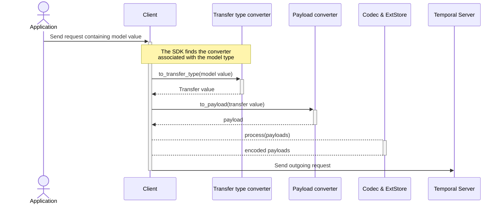
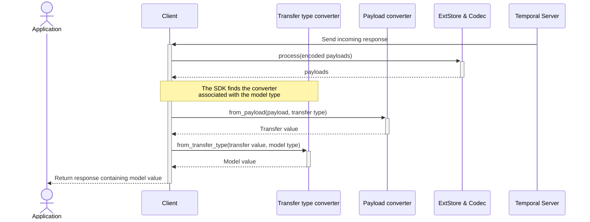

# Transfer Type Converter Behavioral Specification

Last updated: 2026-09-02

## Motivation

Transfer Type Conversion provides a way to translate between a Payload serialization friendly format, e.g. a protobuf object, and a more ergonomic or language-idiomatic type.
TransferTypeConverters are added to the API facing type and specify the target "transfer type" which is then used by the configured Payload Converter serialize to/from a Payload.

For example, given the protobuf definition

```proto3
  message WorkflowExecution {
    string workflow_id = 1;
    string run_id = 2;
  }

  message PauseRequest {
    WorkflowExecution execution = 1;
    string reason = 2;
  }
```

Using a generated protobuf object in Python may force an awkward interface:

```python
request = pause_pb2.PauseRequest(reason="maintenance")

# This does not test presence. Protobuf returns an empty message.
assert request.execution is not None
assert request.execution.workflow_id == ""

# You must use the protobuf specific inspection for presence.
if request.HasField("execution"):
    print(request.execution.workflow_id)
else:
    print("No workflow execution provided")
```

Adding a TransferTypeConverter allows you to construct a more idiomatic type:

```python
@dataclass(frozen=True, slots=True)
class WorkflowExecution:
    workflow_id: str
    run_id: str


# Add the PauseRequestConverter that converts to and from pause_pb2.PauseRequest
@transfer_type_convertible(PauseRequestConverter)
@dataclass(frozen=True, slots=True)
class PauseRequest:
    reason: str
    execution: WorkflowExecution | None = None


request = PauseRequest(reason="maintenance")

# Can use normal Python optional-value semantics:
if request.execution is not None:
    pause_workflow(request.execution.workflow_id)
else:
    print("No workflow execution provided")
```

## Terminology

- **Model type:** The user-facing type associated with a transfer type converter.
- **Model value:** A value of the model type.
- **Transfer type:** The serializer-facing type produced from a model value.
- **Transfer value:** A value of the transfer type.
- **Transfer type converter:** The conversion logic to map between the model type and the transfer type.

## Behaviors

### Conversion Flow

#### Encoding

When encoding a value, the transfer type converter is applied to the model type **before** the payload converter so the payload converter receives the transfer type. The external storage processing and codec are applied as normal to the resulting payload.



1. Locate the transfer converter from the declared model type.
2. Invoke the transfer converter when one is present.
3. Pass the resulting transfer value to the configured payload converter.
4. Apply external storage processing and payload codecs according to the SDK's existing data-converter contract.

#### Decoding

When decoding a value, external storage processing and codec are applied as normal to the payload. Then the transfer type converter is applied to the transfer type **after** the payload converter so.



1. Apply payload codecs and external storage retrieval.
2. Locate the transfer converter from the requested model type.
3. Ask the configured payload converter to decode the payload as the transfer type.
4. Invoke the transfer converter to reconstruct the requested model value.

### SDK Behavior

#### Top-level values only

Transfer conversion only applies to top-level values and does not recursively inspect fields for transfer types.

Nested serialization is the responsibility of the configured payload converter.

#### At most one transfer step

Transfer type converters are applied at most once. For example, given:

- type `A` has transfer type converter `converterA`
- `converterA` produces the transfer type `B`
- type `B` has transfer type converter `converterB`

When encoding type `A`, the SDK does not inspect the output type `B` for a transfer type converter and thus does not apply `converterB`.

Similarly when decoding, the SDK will convert using only the transfer type encoder registered on the requested model type.

#### TransferTypeConverter Selection

Converting to the transfer type should use the type hint for the target execution rather than the value's runtime type. For example:

```java
  // Given this workflow
  @WorkflowMethod
  void run(Animal animal);

  // And this invocation
  Animal value = new Dog();
  workflow.run(value);
```

Here the transfer type converter associated with `Animal` should be used to
even if `Dog` also has a transfer type converter ensure decoding can match.
If the type hint does not have an associated transfer type converter, the
value is passed directly to the configured payload converter.

Converting from the transfer type should also use the type hint for the target execution. If the type hint does not have an associated transfer type converter,
the result of the configured payload converter should be used directly.

A transfer converter declaration applies only to the exact model type on which it is declared. Declarations are not inherited from a base type.

A subclass or other derived type can declare its own converter independently of its base type.

#### Transfer Type Nullability

TransferTypeConverters should specify a non-null transfer type.

#### Failure conversion

Failure conversion should use the transfer converter before
applying the configured payload converter to failure details.
