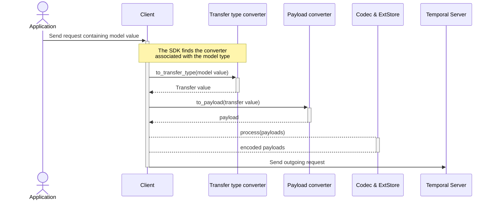
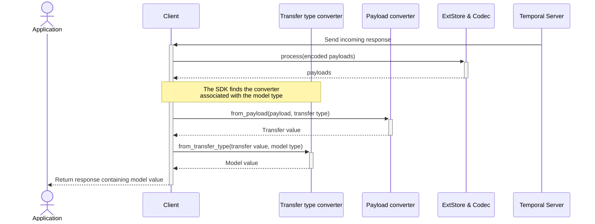

# Transfer Type Converter Behavioral Specification

Last updated: 2026-09-02

## Motivation

Transfer Type Conversion provides a way to translate to and from a Payload serialization friendly format, e.g. a protobuf object, to a more ergonomic or language idiomatic type.
TransferTypeConverters are added to the API facing type and specify the target "transfer type" which is then used by the configured Payload Converter serialize to/from a Payload.

For example, given the protobuf definition

```proto3
  message WorkflowExecution {
    string workflow_id = 1;
    string run_id = 2;
  }

  message PauseRequest {
    WorkflowExecution execution = 1;
    string reason = 2;
  }
```

Using a generated protobuf object in Python may force an awkward interface:

```python
request = pause_pb2.PauseRequest(reason="maintenance")

# This does not test presence. Protobuf returns an empty message.
assert request.execution is not None
assert request.execution.workflow_id == ""

# You must use the protobuf specific inspection for presence.
if request.HasField("execution"):
    print(request.execution.workflow_id)
else:
    print("No workflow execution provided")
```

Adding a TransferTypeConverter allows you to construct a more idiomatic type:

```python
@dataclass(frozen=True, slots=True)
class WorkflowExecution:
    workflow_id: str
    run_id: str


# Add the PauseRequestConverter that converts to and from pause_pb2.PauseRequest
@transfer_type_convertible(PauseRequestConverter)
@dataclass(frozen=True, slots=True)
class PauseRequest:
    reason: str
    execution: WorkflowExecution | None = None


request = PauseRequest(reason="maintenance")

# Can use normal Python optional-value semantics:
if request.execution is not None:
    pause_workflow(request.execution.workflow_id)
else:
    print("No workflow execution provided")
```

## Terminology

- **Model type:** The user-facing type associated with a transfer type converter.
- **Model value:** A value of the model type.
- **Transfer type:** The serializer-facing type produced from a model value.
- **Transfer value:** A value of the transfer type.
- **Transfer type converter:** The conversion logic to map between the model type and the transfer type.

## Behaviors

### Conversion wraps configured payload converters

#### Encoding

When encoding a value, the transfer type converter is applied to the model type **before** the payload converter so the payload converter receives the transfer type. The external storage processing and codec are applied as normal to the resulting payload.



1. Locate the transfer converter from the top-level model value's runtime type.
2. Invoke the transfer converter when one is present.
3. Pass the resulting transfer value to the configured payload converter.
4. Apply external storage processing and payload codecs according to the SDK's existing data-converter contract.

#### Decoding

When decoding a value, external storage processing and codec are applied as normal to the payload. Then the transfer type converter is applied to the transfer type **after** the payload converter so.



1. Apply payload codecs and external storage retrieval.
2. Locate the transfer converter from the requested model type.
3. Ask the configured payload converter to decode the payload as the transfer type.
4. Invoke the transfer converter to reconstruct the requested model value.

### Top-level values only

Transfer conversion only applies to top-level values and does not recursively inspect fields for transfer types.

Nested serialization is the responsibility of the configured payload converter.

### Exactly one transfer step

Transfer type converters are applied at most once. For example, given:

- type `A` has transfer type converter `converterA`
- `converterA` produces the transfer type `B`
- type `B` has transfer type converter `converterB`

When encoding type `A`, the SDK does not inspect the output type `B` for a transfer type converter and thus does not apply `converterB`.

Similarly when decoding, the SDK will convert using only the transfer type encoder registered on the requested model type.

### Encode and decode type selection

Encoding MUST select a converter using the top-level value's runtime type. A null outbound value has no runtime model type and MUST pass directly to the configured payload converter.

Decoding MUST select a converter using the requested user-facing type. If the SDK has no requested type information, it MUST return the configured payload converter's normal result without applying transfer reconstruction.

The SDK MUST provide the requested model type information available in its type system when selecting the transfer type and reconstructing the model value. This includes generic arguments when the SDK's conversion API preserves them.

### Converter declaration and lookup

A transfer converter declaration applies only to the exact model type on which it is declared. Declarations MUST NOT be inherited from a base type.

A subclass or other derived type MAY declare its own converter independently of its base type.

Runtime encoding MUST look only for a converter declared by the exact runtime type. Inbound decoding MUST look only for a converter declared by the exact requested type.

Every selected converter MUST provide a concrete, non-null transfer type for inbound payload conversion. The SDK MUST fail clearly if the converter does not provide a valid transfer type. It MUST NOT fall back to payload metadata inference after selecting a converter.

### Transfer value nullability

When a converter has been selected for an inbound model type, the SDK MUST invoke its reconstruction hook even when the decoded transfer value is null.

This permits a non-null model value to use null as its transfer representation.

An outbound null model value MUST pass through without converter lookup because no runtime model type is available.

### Failure conversion

Failure semantics MUST remain owned by the configured failure converter.

The failure converter MUST use the same transfer-aware payload-conversion path used for ordinary arguments and results when encoding or decoding typed failure payloads. This includes:

- Application failure details.
- Cancellation details.
- Timeout last-heartbeat details.
- Reset workflow failure details.
- Details contained in nested failure causes.

Payload codecs and external storage transformations MUST be applied exactly once to failure payloads and in their normal order.

Transfer conversion does not apply to untyped failure metadata such as messages, stack traces, failure types, retry state, or encoded failure attributes. Existing payload-codec behavior for encoded failure attributes remains unchanged.

### Raw payloads

A raw payload wrapper MUST preserve its existing pass-through behavior. A transfer converter MUST NOT reinterpret a raw payload wrapper as a model value.

### Configured converter authority

The configured payload converter remains authoritative over the transfer representation's wire format. Transfer conversion MUST NOT add transfer-specific payload metadata or choose a wire encoding independently.

The configured failure converter remains authoritative over the mapping between language exceptions and Temporal failure protos.

### Serialization context

Transfer conversion MUST preserve serialization context propagation to payload converters, failure converters, codecs, and external storage components.

### Converter lifetime and concurrency

Converter construction, lookup, and invocation MUST be safe under concurrent serialization. An SDK MAY reuse converter instances, so converter implementations MUST satisfy the concurrency requirements documented by that SDK.

The number of converter instances and the time at which they are constructed are not part of the portable behavior.

### Invalid declarations and callback failures

An invalid converter declaration MUST fail clearly before conversion completes. Examples include an incompatible converter, a converter that cannot be constructed according to the SDK's API, or an invalid transfer type.

Exceptions raised by transfer callbacks MUST remain observable as conversion failures. The SDK MUST NOT silently fall back to ordinary model serialization after selecting a converter.

## Conformance requirements

An implementation conforms to this specification when all of the following hold:

- Ordinary arguments and results satisfy the normative conversion order.
- Failure details use transfer conversion without bypassing a configured failure converter.
- Payload codecs and external storage transformations are applied exactly once.
- A selected converter reconstructs from a null transfer value.
- Top-level-only and one-step behavior have explicit regression tests.
- Raw payload pass-through remains intact.
- Context propagation remains intact.
- Exact converter lookup is implemented and documented as non-inherited behavior.
- Workflow history containing transfer-represented values can be replayed.

## Required conformance tests

### Payload conversion

- Annotated argument and result round trip.
- Mixed annotated and ordinary values preserve position and type.
- Missing payloads still produce language-default values.
- Available requested type information reaches converter selection and reconstruction.
- Null outbound model passes through.
- Non-null model represented by null reconstructs through its hook.
- Raw payload wrapper passes through unchanged.

### Conversion boundaries

- Annotated `A` converts to annotated `B` without invoking `B`'s converter.
- Annotated nested values do not invoke their converters.
- An unannotated subclass does not inherit an annotated base converter.
- A subclass can declare its own converter independently.

### Failures

- Application failure details round trip.
- Cancellation details round trip.
- Timeout last-heartbeat details round trip.
- Nested failure causes round trip their details.
- Custom failure converter remains authoritative.
- Payload codecs transform each failure payload exactly once.

### Integration surfaces

- Workflow client and worker.
- Workflow history replay.
- Activity stubs and standalone activity client.
- Local activities and activity heartbeats.
- Nexus client and worker.
- Schedule client create and describe operations.
- Test activity environment.
