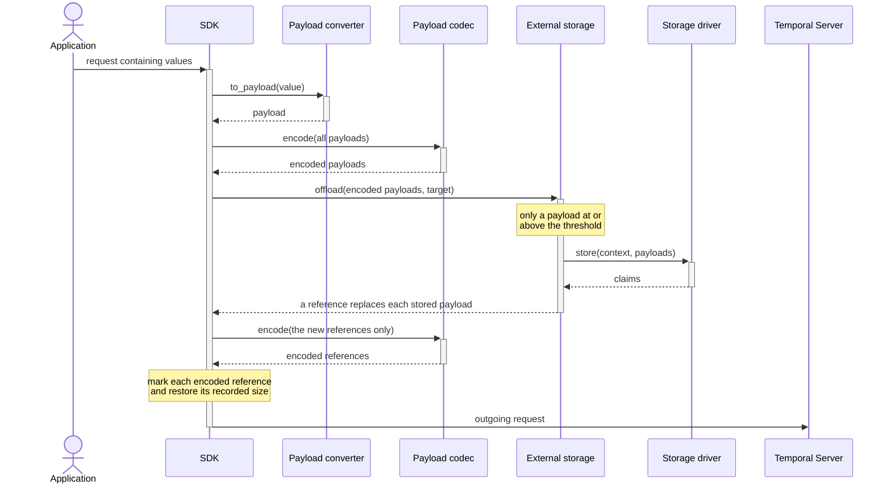
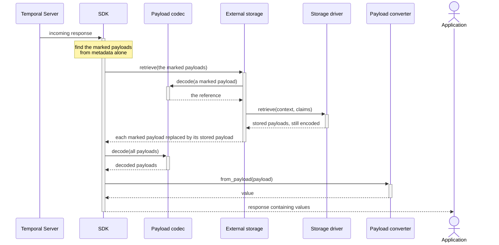

# External Storage Specification

Last updated: 2026-09-30

## Motivation

Temporal carries every workflow input, activity input, activity result, signal, query,
update, memo and header through the workflow's history. The server enforces a size limit on
each of those payloads, and a separate limit on a memo. A payload above the limit is
rejected, so a workflow cannot pass data larger than the limit even when the application has
somewhere to put it.

External storage removes that constraint with a claim check. When a payload is large enough
to be worth moving, the SDK writes the payload to storage that the customer controls, and
puts a small reference in its place. The reference travels through history; the bytes do
not. A worker that reads the history resolves the reference back to the original payload
before the application sees it, so workflow and activity code is unchanged.

Two consequences are worth stating at the start, because they shape the rest of this
document.

The SDK performs the offload, not the server. The customer's payload bytes go directly from
the SDK to the customer's storage, and Temporal sees only the reference. This keeps large
data out of history and out of Temporal, but it also means every SDK that reads such a
history needs a way to resolve a reference. An SDK that encounters a reference it cannot
resolve must fail loudly rather than hand the reference to application code.

The payload still has to be readable later. A workflow replays, and replay reads the same
payloads again. External storage is therefore not a fire-and-forget write: a reference in
history is a promise that the object is still retrievable for as long as the execution can
be replayed.

## Terminology

- **Payload:** a `temporal.api.common.v1.Payload`, which is metadata and bytes.
- **Offload:** to write a payload to external storage and replace it with a reference.
- **Inline:** left in history as an ordinary payload, not offloaded.
- **Reference:** the payload that replaces an offloaded payload. It holds the driver name and
  the claim data, and nothing else of the original.
- **Claim:** the driver-defined data that identifies a stored object. A driver produces a
  claim when it stores, and receives the same claim back when it retrieves.
- **Claim data:** the key and value pairs inside a claim, for example a bucket and an object
  key.
- **Driver:** the component that writes a payload to a storage system and reads it back.
  A driver is supplied by the application, not by the SDK.
- **Driver name:** the identifier of one driver instance. The name goes into each reference
  the driver produces, and the SDK uses it to find the driver again on the read path. A name
  is effectively permanent: renaming a driver makes existing references unresolvable.
- **Driver type:** the identifier of the driver implementation, the same across every
  instance and ideally across SDKs, for example `aws.s3driver`. The SDK uses the type for
  metrics and for worker heartbeat reporting, never for retrieval.
- **Selector:** the component that chooses which driver stores a payload, or chooses to leave
  it inline.
- **Threshold:** the size at or above which a payload is considered for offload.
- **Storage target:** the execution that must read this payload again, principally during
  replay. A driver can use it to choose a storage layout or to choose between storage
  systems.
- **Ambient namespace:** the namespace of the client or worker performing the operation, as
  distinct from the namespace inside a storage target.

Two distinctions in that list cause trouble if they are missed.

A storage target is not a statement about who owns the object or how long it should live. It
is easy to read it that way and the reading is wrong. Lifecycle management is deferred and no
SDK deletes anything today, so a driver must not use the target to decide when an object can
be removed. A later version of this specification may make the target more precise in order
to support lifecycle management.

A storage target is also not a serialization context. The serialization context answers which
context deserializes a payload; the storage target answers which execution reads it again.
For the same payload these can differ in value and in kind. When a workflow schedules an
activity, the serialization context is the activity's, because the activity deserializes its
own input, but the storage target is the enclosing workflow, because the workflow is what
replays.

## Wire format

An offloaded payload is replaced by a reference payload with exactly this shape.

The `encoding` metadata is `json/protobuf`. The `messageType` metadata is
`temporal.api.sdk.v1.ExternalStorageReference`. The data is the protojson encoding of that
message, which carries the driver name and the claim data.

The reference also carries `external_payloads[0].size_bytes`, set to the proto-encoded size
of the payload that was handed to the driver. The server reads this value to account for
offloaded bytes. It is not part of the exchange contract: a producer that omits it still
produces a reference that any SDK can read, and a consumer must not depend on it being
present.

The payload that finally goes into the request also carries the metadata item
`__temporal_external_storage_reference`, with the value `true`. The SDK attaches this item after the
codec has encoded the reference, so it sits on the outermost payload where a reader can see
it without decoding anything. When no codec is configured the reference is itself the
outermost payload, and it carries the item just the same. This follows the same convention as
the `__temporal_system_payload` item that marks a system Nexus envelope.

A payload therefore needs retrieval when either of two conditions holds, and both are
readable from metadata alone:

- The payload carries `__temporal_external_storage_reference`.
- The payload has an encoding of `json/protobuf` and a message type of
  `temporal.api.sdk.v1.ExternalStorageReference`.

Neither half of the second condition is sufficient on its own, because `json/protobuf` is an
ordinary encoding used for any protobuf payload. The second condition exists for a reference
that no codec encoded, and for a history written before the marker existed.

Earlier prereleases used an encoding of `json/external-storage-reference` with a different
body. That encoding is being removed before general availability. An SDK must not produce it,
and a new SDK must not implement reading it.

## Behaviors

### Offload

The offload path runs whenever an SDK sends payloads to the server.

The steps are:

1. Convert each value to a payload with the configured payload converter.
2. Apply the payload codec to every payload.
3. Measure each encoded payload. A payload is eligible when its proto-encoded size is at or
   above the threshold. This is the size after the codec has run, so a codec that compresses
   can take a payload back below the threshold.
4. Ask the selector which driver should store each eligible payload. The selector may return
   nothing, which leaves that payload inline.
5. Group the payloads by driver and call each driver once with its group. A driver returns
   one claim for each payload, in the same order.
6. Replace each stored payload with a reference, and record the pre-offload proto size in
   `external_payloads`.
7. Apply the payload codec a second time, to the new references only. This keeps claim data
   out of history in the clear.
8. Attach `__temporal_external_storage_reference` to the encoded reference, and restore
   `external_payloads` onto it if the codec did not preserve it.

Step 7 applies to the references and to nothing else. Identify them against the list that
went into step 5, not by re-examining encodings, which would encode inline payloads twice.
Step 7 must not re-run the eligibility test from step 3; an encode-then-offload loop would
recurse.

Two properties follow, and they are the test for any implementation. Every payload in history
carries exactly one codec application, so its encoding never reveals whether it was
offloaded. And what sits in external storage is byte-identical to what history would have
held had the payload stayed inline.

### Retrieval

The retrieval path runs whenever an SDK receives payloads from the server. It is the inverse
of the offload path, but it is not symmetric with it, because the marker lets the SDK find
the references without decoding anything first.

The steps are:

1. Find the payloads that need retrieval, using the two metadata conditions in the wire
   format section. This reads metadata only. No payload is decoded, and a payload that needs
   no retrieval is not touched.
2. For each of those payloads, obtain the reference. A payload carrying the marker was
   encoded by the codec, so decode that one payload to get the reference. A payload that
   matches on encoding and message type is already the reference.
3. Read the driver name and the claim data. Group the claims by driver name and look up each
   driver by that name. A reference naming a driver that is not registered is an error.
4. Call each driver once with its group of claims. A driver returns one payload for each
   claim, in the same order.
5. Substitute each retrieved payload for the payload it came from. **Leave the retrieved
   payload as the driver returned it.** What the driver returns is the payload as it was
   handed to `store()`, which is to say codec-encoded, and therefore identical in form to an
   inline payload at the same position.
6. Everything after this point is the SDK's ordinary path: the codec decodes every payload,
   and the payload converter produces values.

Two of those steps carry the weight, and an implementation that gets either wrong will look
correct until a codec is configured.

Step 5 leaves the retrieved payload exactly as the driver returned it. A retrieved payload is
then indistinguishable from an inline one, so nothing downstream needs to know that external
storage exists, and the SDK never has to decode a payload twice or track which payloads it
has already decoded.

Step 1 reads metadata and nothing else. An SDK that applies its codec downstream of this
point, per data-converter call, cannot decode every payload here to look for references: the
payloads would reach the data converter already decoded and be decoded again. Detecting from
metadata, and decoding only a marked payload, leaves every other payload untouched.

The codec still runs the same number of times as an unconditional decode would have given it:
once for a payload that was never offloaded, twice for one that was.

Step 4 passes the driver nothing but the claims. The retrieve context carries no storage
target, so that any worker holding the driver can read a payload back, whichever execution is
doing the reading.

An SDK that finds a payload needing retrieval and has no external storage configured must
fail with `TMPRL1105`. This applies to every SDK, including one with no external storage
support at all; the alternative is handing a reference to application code as though it were
the application's own data. Such an SDK should say so in the error rather than telling the
user to configure something it does not have. Detecting this needs no codec and no driver.

A history written before the marker existed still reads: its references were never
codec-encoded, so step 1 finds them by the second metadata condition, already in plain form.

### Coverage

Every payload an SDK sends to the server passes through external storage: workflow inputs and
results, activity inputs and results, signals, queries, updates, headers, memo fields, Nexus
operation inputs and results, and failure details.

Search attributes are the one exception. The server indexes and searches their literal values,
so replacing one with a reference would make it unsearchable and change the meaning of a
query. An SDK must leave search attributes untouched on both paths.

The paths to cover are every place payloads cross the boundary: a client request; a client
response; a workflow task, in both directions; an activity task, in both directions; an
activity heartbeat; a Nexus task, in both directions; and replay.

Local activity inputs and results are in scope, because they reach history inside marker
commands. An SDK that builds the marker command itself offloads as part of building the
completion. An SDK that hands the result to a lower layer and lets that layer build the marker
must offload before handing it over, because that layer performs no storage operations.

Coverage has to stay complete as Temporal adds payload-bearing fields to its API, and the
requirement is that outcome: an SDK must not miss one. The recommended way to achieve it is a
payload visitor generated from the Temporal API, reaching every payload-bearing message and
field the API declares. An SDK that applies external storage at each call site instead has to
connect every call site by hand, and one nobody connected fails silently.

### Driver contract

A driver stores payloads and retrieves them. It exposes a name, a type, a store operation and
a retrieve operation.

The store operation receives a context and a list of payloads, and returns one claim for each
payload, in the same order. The retrieve operation receives a context and a list of claims,
and returns one payload for each claim, in the same order. In both directions the SDK checks
the length of the returned list and that no element is null. A driver must not modify the list
it was given.

A driver receives opaque bytes. The codec has already encoded the payload by the time it
reaches the store operation, so a driver must not parse it, interpret it, or write its content
to a log.

Storing is at-least-once: a task can be retried after a store succeeded but before the
completion was accepted, and external storage also runs during replay. A driver that derives
its key from the content absorbs this, returning the same claim for a repeat store. One that
generates a fresh key each time leaves an unread object behind on every repeat. Deriving the
key from the content is therefore recommended.

A driver must observe cancellation, using whatever mechanism is natural for its language, and
must propagate a deadline where the language expresses one.

An SDK must distinguish the sources of a cancellation, which do not mean the same thing. A
worker shutting down should stop a storage operation, and must not be reported as a task
failure. A cancelled, paused or reset activity must **not** stop a storage operation — that
activity's result still has to be sent. An SDK must also confirm a cancellation came from the
source it expects rather than assuming so from the exception type, because a driver failing
at the same moment is a different event and still has to be reported.

A driver must tolerate a target kind it does not recognise, since this specification may add
one.

### Storage target

A storage target names the execution that must read this payload again. The main reader is
replay.

A storage target is **not** a statement of ownership and **not** a retention rule. Lifecycle
management is deferred and no field of the target expresses a lifetime, so a driver must not
use the target to decide when an object can be deleted. A later version of this specification
may make the target more precise in order to support lifecycle management.

A storage target is also not the serialization context. The two answer different questions and
can differ in value and in kind for the same payload.

There are three kinds. A workflow target carries a namespace, a workflow id, a run id and a
workflow type. An activity target carries a namespace, an activity id, a run id and an
activity type. A Nexus target carries an endpoint, a service name and an operation name. The
namespace is required in the workflow and activity kinds; every other field is set when the
call site knows it.

A Nexus target has no namespace field. A caller starting a Nexus operation does not know
which namespace will handle it — that is what an endpoint is for — and on the handling side
the namespace is the handler's own, which the context already carries. The endpoint is what
identifies a Nexus target.

An activity that a workflow started uses the enclosing workflow as its target, not itself.
Replay does not run a completed activity, but it does run the workflow, so the workflow is the
execution that reads the payload again. Only a standalone activity uses itself.

The select context and the store context also carry the ambient namespace, meaning the
namespace of the client or worker performing the operation. This is always available, so a
driver has a partition key even where no target could be produced. It is normally the same
value as the namespace inside the target; the two differ only for a namespace that re-enables
cross-namespace operations, which are deprecated and disabled by default from server 1.30.1,
or for a history written before they were disabled. A driver choosing a storage layout should
prefer the target's namespace when a target is present.

The retrieve context carries no target and no ambient namespace, so that retrieval depends
only on the claim.

#### Which fields each call site provides

Which fields are available is a property of the call site, not of the SDK. A request that
starts something has no run id, because the server has not assigned one. A request addressed
to an existing execution has a run id, and has the type only where something supplies it: the
dispatched task, for a worker, or the caller, for a client API that already asks for the type
in order to build the serialization context. An SDK has a defect when it omits a field the
call site could have supplied.

| Operation | Kind | What it identifies | Fields |
| --- | --- | --- | --- |
| Start a workflow, or signal with start | workflow | the workflow being started | namespace, workflow id, workflow type |
| Signal, update, query, cancel or terminate a workflow | workflow | the workflow addressed | namespace, workflow id, run id |
| Create or update a schedule | workflow | the workflow the schedule starts | namespace, workflow id, workflow type |
| Report an activity result — complete, fail, cancel or heartbeat — addressed by workflow id | **workflow** | the workflow that scheduled the activity | namespace, workflow id, run id, workflow type |
| The same, addressed by activity id | activity | the standalone activity | namespace, activity id, run id, activity type |
| The same, addressed by task token | whatever the caller supplied, or none | see below | see below |
| Workflow task completion | workflow | the current workflow, retargeted for each command below | namespace, workflow id, run id, workflow type |
| Activity task, scheduled by a workflow | **workflow** | the workflow that scheduled the activity | namespace, workflow id, run id, workflow type |
| Activity task, standalone | activity | the activity itself | namespace, activity id, run id, activity type |
| Nexus operation | nexus | the operation being handled | endpoint, service, operation |

The two rows in bold are the ones that surprise. An operation about an activity carries a
**workflow** target whenever a workflow scheduled that activity, because the workflow is what
replays and therefore what reads the payload again. Only a standalone activity carries an
activity target.

A task token is opaque to the SDK. The SDK cannot read a namespace, a workflow id or an
activity id out of it, so it has nothing of its own to build a target from.

It does not need to invent one, because the same call already needs an identity for another
purpose. To build the serialization context for an activity result, an SDK asks the caller
for the namespace, the workflow id, the workflow type and the activity type. When the caller
has supplied those, the SDK builds the target from the same values, and the kind follows the
usual rule: a workflow target when a workflow id is present, an activity target when only an
activity identity is.

When the caller has supplied nothing — which is what happens with the convenience form that
takes only a task token and a result — the SDK sends **no target**. It must not send a target
of a guessed kind with no fields set. An absent target tells a driver that the SDK does not
know what this payload is for; a workflow target with everything blank tells it something
untrue, and a driver that switches on the kind will act on it.

#### Retargeting for each command

A workflow task completion carries many commands, and a command can address something other
than the current workflow. The base target is the current workflow, and these commands
change it.

| Command | Target |
| --- | --- |
| Start a child workflow | the child: namespace, workflow id, workflow type. No run id, because the server has not assigned one |
| Signal an external workflow | the workflow addressed: namespace, workflow id, run id |
| Continue as new | the same workflow id, and the new workflow type when the command sets one. **No run id**, because the successor run does not have one yet |
| Complete a workflow that has a parent, and is not a continue as new | the parent: namespace, workflow id, run id |
| Schedule an activity, or a local activity | unchanged: the current workflow |

This enumeration must be exhaustive. A command that this specification does not list must
fail loudly rather than inherit the current workflow, because a command whose target nobody
considered then gets a target that looks correct and is wrong.

An SDK should structure the enumeration so that this is enforced rather than remembered: a
command added to the Temporal API should fail to compile, or fail the build, until somebody
decides what its storage target is. An enumeration that falls through to a default gives the
new command the current workflow, silently.

### Selector contract

A selector receives the select context and one payload, and returns the driver that should
store it, or nothing to leave the payload inline.

The select context is a distinct type from the store context. It carries the target and the
ambient namespace, and it does not carry anything that belongs to a storage operation.

A selector must return one of the registered drivers. An SDK checks this by identity, not by
name, so that a driver constructed to look like a registered one is rejected. A language
whose identity comparison can fault may fall back to comparing names rather than propagating
the fault.

### Configuration

Where the configuration lives depends on what a data converter is in that language. Where the
user supplies a data converter that wraps and replaces conversion as a whole, external storage
belongs on the options of the lowest object that both the client and the worker derive from.
Where the data converter is a set of separate components that transform payloads, external
storage belongs on the data converter.

The second kind reaches every client and the replayer on its own. The first kind does not, so
external storage must be configurable for the workflow client, the Nexus client, the schedule
client, and the standalone replayer used in tests.

At least one driver is required; an SDK should reject a configuration with none. Every driver
name must be unique within a configuration, and no name may be empty — the name is how the
retrieval path finds the driver.

A selector is required when more than one driver is registered. With exactly one driver the
selector is optional, and that driver takes every payload above the threshold.

The threshold defaults to 256 KiB. Zero means every payload is offloaded, not that the
default applies. A negative threshold is rejected.

The two budgets belong on the external storage configuration rather than the worker, so that
they apply to a client as well. The budget for one message defaults to eight, and the budget
shared across a configuration defaults to sixty-four. Each must be a positive integer.

Whether an SDK exposes the concurrency of the visit is up to that SDK. If it does, the value
must be greater than zero; one is valid and means serial offload.

An SDK whose configuration object cannot express the difference between absent and empty, or
between zero and unset, may accept the ambiguous value and treat it as the default. See
Language Specific Considerations.

### Concurrency

External storage adds requests to paths that had none, so an SDK has to bound how many of
those requests are in flight. It does this by handing each driver a limiter, and asking the
driver to take a permit around each request it makes.

The limiter appears on the store context and on the retrieve context. It does not appear on
the select context, which is one reason those are distinct types.

A limiter has one method. It takes the item the request covers — a payload when storing, a
claim when retrieving — and the operation to run, and it runs that operation once a permit is
available, releasing the permit when the operation settles. The item is one payload or one
claim rather than the whole batch, because a driver takes a permit for each request it makes,
and a batch usually becomes several requests. The item also lets an SDK price a permit by
something other than a simple count; an SDK that does not do so ignores it.

#### Two budgets

A permit draws on two budgets, and the operation runs only when both allow it.

The first is the budget for one message, meaning one activation, one activity task, one
client request, or one Nexus operation. Every message gets its own. This stops a message
carrying many large payloads from consuming the whole allowance and starving the others.

The second is shared by every driver of one external storage configuration. This is the
process-wide ceiling. An application that gives the same configuration to a worker and to a
client gets a single budget across both; an application that gives each its own
configuration gets separate budgets. The shared budget is what bounds a client, which has no
slot supplier to bound it.

A permit takes the message budget first and the shared budget inside it.

#### Visiting concurrently

The number of payload-bearing fields an SDK transforms at once must be greater than zero. One
is valid, and means the SDK works through a message's fields one after another. An SDK must
allow more than one, so that a message graph carrying several payload-bearing fields can make
progress on more than one of them. What the value defaults to, whether it has an upper bound,
and whether an application can configure it, are left to the SDK; unbounded is permitted but
not required.

Visiting one field at a time is not the same as making one request at a time. A single
payload-bearing field can hold many payloads, so one visit hands the driver a batch, and the
driver turns that batch into as many requests as it needs, each taking a permit. The budgets
therefore apply at every setting of the visit concurrency, including one.

The two mechanisms measure different things. The visit concurrency bounds how many
payload-bearing fields are in flight; the budgets bound how many storage requests are in
flight, whichever field they came from.

They must also be separate mechanisms. One mechanism serving both deadlocks as soon as it
fills: the visit holds a permit while calling the driver, the driver waits for a permit that
only the visit's own completion can release, and neither proceeds.

The same hazard applies inside a driver, which can deadlock by taking a permit while already
holding one. A driver decides what one operation is, and should take one permit for it.

#### Participation

The limiter is cooperative. An SDK cannot force a driver to use it, and a driver that
ignores it makes requests that no budget counts.

An SDK detects this rather than leaving it silent. When a driver completes a store or a
retrieve without having taken a permit, the SDK logs a warning naming the driver and saying
that its requests are unbounded.

Acquiring a permit must be cancellable, because a driver can wait for one on a path that has
a deadline.

#### Where this sits

A worker's slot supplier bounds how many units of work run at once. The two budgets above
bound the requests those units make. A driver's own limits bound whatever that driver needs
to protect, such as a connection pool. The three are separate and an SDK should not conflate
them.

### Replay

External storage runs during replay exactly as it does during a first execution. An SDK must
not skip the offload because it is replaying: replay would then exercise a different path from
the one it is meant to verify, and a driver failure, a threshold interaction or a selector
defect would not appear.

The optimisation belongs to the driver. A driver that derives its key from the content can see
that the object already exists and return the same claim without writing, which the driver
knows and the SDK does not.

A differing claim cannot cause a determinism failure, for the same reason differing codec
output cannot: payload bytes are not part of the comparison. Drivers should nonetheless
produce the same object and claim from the same input.

Payload size validation is not part of replay. An SDK validates sizes when it sends to the
server, and a replayer sends nothing; validating a history the server already accepted would
fail it whenever a namespace's limits had been lowered since.

### Failures and recovery

A failure on a workflow task path, in either direction, becomes a workflow task failure. The
task is retried; the workflow is never failed.

Whether the SDK reports that failure to the server depends on the attempt. On the first
attempt it reports the failure as retryable. On any later attempt it reports nothing and lets
the task time out, so that a driver outage does not produce one report per attempt for every
affected workflow. An SDK already does this for other infrastructure failures on this path.

A failure on a query path fails that query, and leaves the workflow alone.

A failure on a Nexus path becomes an internal handler error, marked retryable explicitly
rather than by default.

A failure on an activity path becomes an activity failure, which the activity's retry policy
counts. **The activity therefore runs again, external effects included, because the SDK could
not store a result the activity had already produced.** Temporal cannot redeliver an activity
task without consuming a retry, and sending no response costs the same retry more slowly, so
this is the best available behavior rather than a good one.

An SDK must never fail silently. It logs the failure and emits the failure metric on every
attempt, whether or not it reported to the server — the attempts it deliberately does not
report are the ones that indicate a persistent problem. Letting a task time out is acceptable
only as the attempt-based choice above; an SDK that sends nothing because it could not build
a failure has dropped the diagnostic too. On an attempt that does report, an SDK that cannot
build the structured failure sends a plain one.

An SDK must not send the failure payload through external storage. Reporting a storage
failure through the driver that just failed loses the report as well.

Three channels identify the failure, and two of them are the same in every SDK:

- The `failure_reason` tag on the failure metric is `ExternalStorageError`. This is what an
  operator alerts on.
- A reference found with no external storage configured is `TMPRL1105`. This is where the
  difference between a misconfiguration and a driver outage is carried.
- The task failure cause, where the path has one, is
  `WORKFLOW_TASK_FAILED_CAUSE_EXTERNAL_STORAGE_FAILURE` for a workflow task and
  `ACTIVITY_TASK_FAILED_CAUSE_EXTERNAL_STORAGE_FAILURE` for an activity task, rather than a
  general worker failure. A Nexus operation and a client request have no cause to set. The
  cause does more than name the failure; see the failure metrics below.

The type on the failure itself is not standardized, and an SDK need not use a separate type
for each kind of storage failure.

`TMPRL1105` stays retryable: the customer fixes it by configuring external storage, so the
worker retries until the unit of work exhausts its attempts or its timeout. The cost is that
a misconfigured worker stalls quietly, which is why the observability below is required and
not optional.

### Observability

An SDK reports the latency of its storage operations, the number of bytes moved, and the
failures, tagged by driver type.

Latency is elapsed time, not the sum of the durations of the individual operations. Storage
operations run concurrently, so adding their durations overstates the time actually spent,
and the number an operator compares against a task timeout is the elapsed one.

The size of a retrieved batch is measured from the payloads the driver returned, not read
from the size recorded in the reference. Measuring gives the metric a single meaning — the
bytes this retrieval moved — and makes it comparable with the store side. The recorded size
describes the payload that was handed to the store operation; a faithful driver makes the two
equal, which is exactly why a difference is worth knowing about. The recorded size remains
the right value in the two places where nothing has been fetched yet: the limiter's size
policy, and the server's accounting.

An SDK reports the type of each configured driver in its worker heartbeat.

#### Failure metrics

An SDK sets the task failure cause whenever it fails a task because of an external storage
fault. This single act carries the classification to both places an operator looks.

The cause is recorded in history. A customer reads it from the workflow task failed event and
from the activity task failed event, and so can tell a storage fault from any other worker
failure by inspecting the execution alone.

The cause also tags the metric. A failure carrying one of these causes is counted with
`failure_reason="ExternalStorageError"` on whichever metric counts it:
`workflow_task_execution_failed`, `activity_execution_failed`, or
`local_activity_execution_failed`. A local activity produces no task failed event in history,
so for a local activity the cause exists only to tag the metric.

The metric is emitted on every attempt, including the later attempts on which the SDK stays
silent rather than reporting the failure to the server again. The silence is there to keep the
server from hearing the same failure repeatedly; it must not also hide a worker that is
failing repeatedly from the operator watching it.

### Lifecycle

This version of the specification does not manage the lifecycle of a stored object. No SDK
deletes anything, and no driver operation exists for deleting. Removing an object is the
operator's responsibility, through whatever lifecycle policy the storage system offers.

Two properties of this arrangement need to be understood by anyone setting such a policy.

A driver that derives its key from the content of a payload shares one object between every
payload with those bytes, including payloads belonging to unrelated workflows. Deleting the
objects of one execution can therefore break another.

An object can outlive the execution that stored it. A continue-as-new chain is the clearest
case: the server carries a memo forward to the successor run, so a later run can hold a
reference to an object stored by a run that has already ended. A policy that expires objects
by age can break a long-running chain.

### System Nexus envelopes

A system Nexus envelope is not an ordinary payload. It is recognised by its own metadata, and
external storage must descend into it rather than treat it as one opaque payload: the SDK
offloads the payloads inside the envelope, using the serialization context the envelope
declares, and leaves the envelope itself alone. See the system Nexus documentation.

### Remote codec servers

An SDK can point at a codec server instead of holding a codec locally. Whether that server
can also perform the storage operations is **not yet specified**.

The obstacle is the storage target. A codec server receives a list of payloads over HTTP, so
it cannot derive a target the way a component that sees the whole message can, and the codec
contract carries no target. The retrieval direction has no such problem, because retrieval
needs only the claim.

Until this is settled, an SDK that uses a remote codec server performs the storage operations
itself.

## Language Specific Considerations

These are differences that a language forces, and that this specification accepts. It is not
a list of places where an SDK deviates.

### Go

A Go configuration struct has a zero value, and the zero value has to mean that the feature
is off. Go therefore cannot require at least one driver, and cannot tell a threshold of zero
apart from a threshold that was never set. Go treats zero as the default rather than as
"offload everything". Both exceptions follow from the zero value and from nothing else; an
SDK whose configuration is a nullable object gets both rules for free.

Comparing two interface values for identity can panic in Go when the dynamic type is not
comparable. When validating the driver a selector returned, Go may recover from that and
compare names instead, rather than letting the panic escape.

Go applies the payload codec per data-converter call, inside workflow execution, rather than
as one pass over a message. The external storage layer must therefore be able to invoke the
codec itself: to decode a marked payload on the inbound path, and to encode a new reference
on the outbound path.

### Java

Java applies the payload codec per data-converter call, inside the data converter the user
supplies, rather than as one pass over a message. The external storage layer must therefore
be able to invoke the codec itself: to decode a marked payload on the inbound path, and to
encode a new reference on the outbound path.

### Python

Python is built on asyncio, so cancellation is ambient: cancelling the surrounding task
raises inside the driver at its next suspension point. The driver contexts therefore carry no
cancellation field, and this is the idiomatic result rather than a missing feature. The
consequence for a driver author is that a driver must not swallow the cancellation exception.

### TypeScript

TypeScript is structurally typed, and the workflow, activity and Nexus targets are otherwise
the same shape. A discriminating field is therefore required so that a driver can tell them
apart; the other SDKs distinguish them by type. A driver written in TypeScript switches on
that field, and must still tolerate a value it does not recognise.
